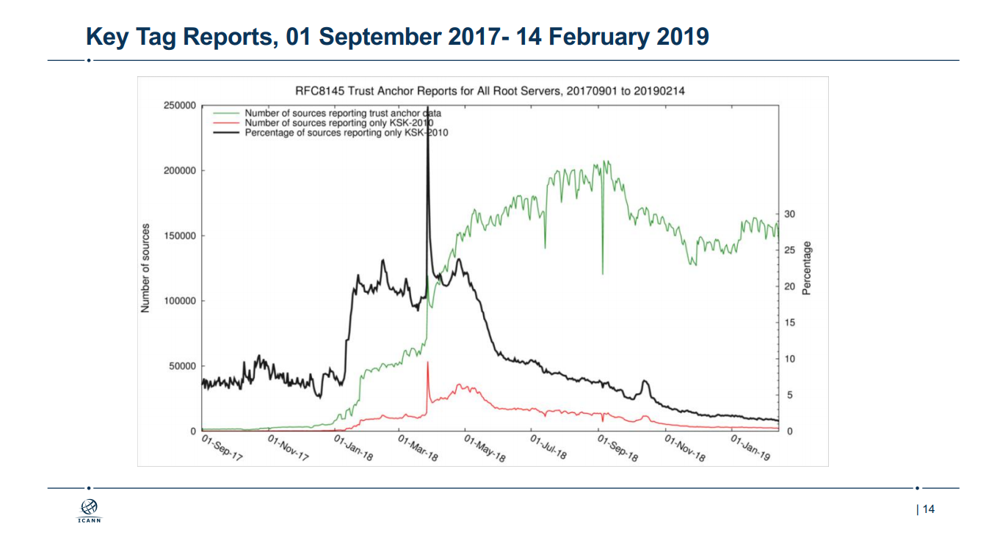
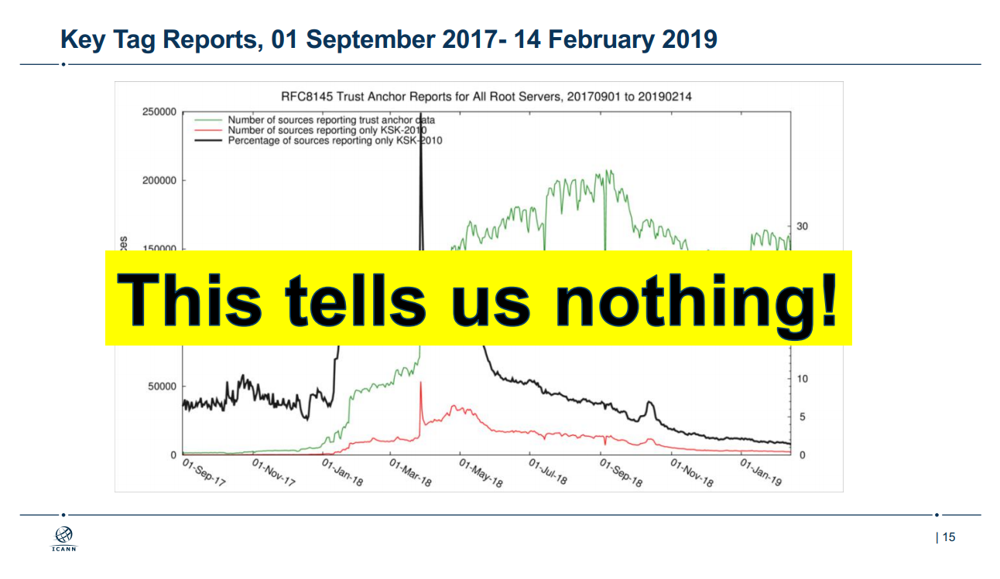

# BIND メモリリーク脆弱性とRoot KSK Rollover

DNS温泉番外編2にて発表できなかったBINDのメモリリーク脆弱性の説明です。

## 脆弱性の概要

* CVE-2018-5744
* ISCからのセキュリティアドバイザリ[A specially crafted packet can cause named to leak memory](https://kb.isc.org/docs/cve-2018-5744)
* 複数のKey Tag Optionを持つDNSクエリを受信すると、メモリをリークします
* 悪用は困難

## 脆弱性の対象

権威サーバ、フルリゾルバのいずれでも対象になります。また、コンパイル時の設定(./configureのオプション)や実行時の設定(設定ファイル)では回避できません。

対象のバージョンは以下のとおりです。

* 9.10.7 -> 9.10.8-P1
* 9.11.3 -> 9.11.5-P1(ESV)
* 9.12.0 -> 9.12.3-P1

対象Linuxディストリビューションは以下の通りです。

* RHEL/CentOSは9.9.5のため対象外
* Debianは[stretch-backports](https://packages.debian.org/stretch-backports/bind9)が対象
* Ubuntuは[18.04LTS](https://packages.ubuntu.com/bionic-updates/bind9)が対象

上記の通り、主にISCが配布しているソースからインストールしているサーバが対象になります。
また回避策は存在しないため、対象バージョンを使用中のサーバはすべて対象になります。

## 攻撃容易性

脆弱性の発見時において、Exploitの存在は確認されていません。しかし、メモリリークの原因は修正版のリリースノートに
原因が記載されていてかつ検証コードの作成は非常に容易なため、**Exploitを欲しい人がいれば**すぐに出てくるでしょう。

しかし実際にこの脆弱性を利用してサービスを妨害することは容易ではありません。
数個のDNSクエリ程度ではサーバ上のメモリを使い切らせることはできず、対象のサーバのメモリ容量と同程度のDNSメッセージを送信する必要があります。
いわゆる”BINDころり”と呼ばれる脆弱性とは異なり、DNSパケットひとつでサービスを止めることはできず、パケットをばらまくことによる無差別攻撃は不可能です。
そして特定のDNSサーバを対象として攻撃する場合でも、攻撃側にも大きな帯域が必要でコストが嵩み、
それで得られる結果がメモリ消費によるDoSとなり攻撃側が得る利益が比較的小さいため、実際に利用する人は存在しないでしょう。

## 詳細(BIND 9.11.x)

BINDはOPTレコード内のオプションを、[process_opt](https://gitlab.isc.org/isc-projects/bind9/blob/v9_11_5_P1/bin/named/client.c#L2127)にて処理します。
EDNS KeyTag Optionがある場合、関数 [process_keytag](https://gitlab.isc.org/isc-projects/bind9/blob/v9_11_5_P1/bin/named/client.c#L2110)を呼びますが、EDNS KeyTagオプションが複数ある場合、``process_keytag``も複数回呼ばれ、その際Key Tag用のメモリを確保済みかどうかを確認せずに、メモリを確保しポインタ``client->keytag``へ代入します。したがって、2度目以降のEDNS KeyTag Optionを処理する前に、以前に確保したメモリを開放することができなくなり、メモリリークします。

[process_opt](https://gitlab.isc.org/isc-projects/bind9/blob/v9_11_5_P1/bin/named/client.c#L2127)

```c
static isc_result_t
process_opt(ns_client_t *client, dns_rdataset_t *opt) {

// snip

        case DNS_OPT_KEY_TAG:
				result = process_keytag(client, &optbuf,
							optlen);
				if (result != ISC_R_SUCCESS) {
					ns_client_error(client, result);
					return (result);
				}

```

[process_keytag](https://gitlab.isc.org/isc-projects/bind9/blob/v9_11_5_P1/bin/named/client.c#L2110)

```c
static isc_result_t
process_keytag(ns_client_t *client, isc_buffer_t *buf, size_t optlen) {

	if (optlen == 0 || (optlen % 2) != 0) {
		isc_buffer_forward(buf, (unsigned int)optlen);
		return (DNS_R_OPTERR);
	}

	client->keytag = isc_mem_get(client->mctx, optlen);
	if (client->keytag != NULL) {
		client->keytag_len = (uint16_t)optlen;
		memmove(client->keytag, isc_buffer_current(buf), optlen);
	}
	isc_buffer_forward(buf, (unsigned int)optlen);
	return (ISC_R_SUCCESS);
}
```

## 対策

本脆弱性の対策はBINDのバージョンアップのみで、回避策はありません。

## 経緯

本脆弱性の対応の経緯は以下の通りです。当初はこの脆弱性についてJANOG 43のライトニングトークで発表しようと準備していましたが、
脆弱性公表が遅れたため申し込むことはできませんでした。次にDNS温泉番外編での発表を準備しましたが、
さらに脆弱性の公表が遅れ発表できませんでした。[DNS温泉の発表資料にある"CVE-次作をお楽しみに"](https://speakerdeck.com/sischkg/dns-fullresolver-onsen?slide=2)
は本脆弱性のことです。
公表の遅れの原因は、本脆弱性と同時に対応しようとした別の脆弱性
([CVE-2018-5743: Limiting simultaneous TCP clients is ineffective](https://kb.isc.org/docs/cve-2018-5743))
の対応に問題があり、修正版のリリースを取り消したためです。

* 2018/12/09 脆弱性発見、即ISCへ報告
* 2018/12/10 ISCから回答
  + 脆弱性を確認
  + 年末にシステムを更新しない組織があるため、公開は1月の上中旬の予定
* 2018/12/13 脆弱性修正?
  + [Master BranchのCHANGESに"placeholder"追加](https://gitlab.isc.org/isc-projects/bind9/commit/fed3e7a8151468faecb071e9fb6e55f2054833cb?w=1))
* 2018/12/28 ISCより報告
  + 他の脆弱性の対応もあり、公開は1月の後半
* 2019/01/15 BIND 9.11.5-P2/9.12.3-P2 ASNへ公開?
  + ftp.isc.org/isc/bind9/private の更新
* 2019/01/23 更新後のBINDの不具合修正?
  + [Master BranchのCHANGESに"placeholder"追加](https://gitlab.isc.org/isc-projects/bind9/commit/1b1cd4de2fb019b8887b652b074eeffcc70d5c5a)
* 2019/01/23-25 JANOG 43
* 2019/01/29 BIND 9.11.5-P3/9.12.3-P3 ASNへ公開?
  + ftp.isc.org/isc/bind9/private の更新
* 2019/01/24 更新後のBINDの不具合修正?
  + [Master BranchのCHANGESに"placeholder"追加](https://gitlab.isc.org/isc-projects/bind9/commit/088008328cd8474f2d6e0e067c552c87ee880f1b)
* 2019/02/07 BIND 9.11.5-P4/9.12.3-P4 ASNへ公開?
  + ftp.isc.org/isc/bind9/private の更新
* 2019/02/16 DNS温泉番外編
* 2019/02/22 脆弱性公開

## KeyTag Option(RFC 8145)

先に説明したとおり、KeyTag Optionを実装する際に本脆弱性が埋め込まれました。KeyTag OptionとはRFC8145にて定義された
EDNSオプションで、昨年実施されたRoot KSK Rolloverの進行状況を踏査するために利用されるはずのものでした。

Root KSK Rolloverでは、Root Zoneを署名するためのZSKを署名する鍵であるのKSKを新規に作成し、既存のものと入れ替えます。
その際にDNSSEC Validator側でも新しいトラストアンカー(=KSKの公開鍵)を設定する必要があります。
もしKSK Rollover前に新しいトラストアンカーを設定していなければ、Rollover後そのValidatorでDNSSECの署名検証に失敗し、
名前解決もできなくなります。そこでKSK Rolloverの実施可否の判定材料として新しいトラストアンカーの設定の状況を観測するために、
[RFC8145 Signaling Trust Anchor Knowledge in DNS Security Extensions (DNSSEC)](https://tools.ietf.org/html/rfc8145)
が定義され、Validatorで実装されました。

RFC 8145では、設定されているトラストアンカーのKeyTagを権威サーバ（=Root Server)へ通知するため、
以下の２通りの方法を定義しています。

* EDNSのOPTレコードに **Key Tag option** を追加
* QNAMEに `_ta-tagXXXX`とKey Tagを含むクエリを送信 

Open SourceなDNS Resolver/ValidatorのRFC 8145の実装状況は以下の通りになっています。

* [BIND 9.9.10, 9.10.5, 9.11.0](https://kb.isc.org/docs/aa-01528) (2016/10/04, default on)
* [Unbound 1.6.4](https://nlnetlabs.nl/projects/unbound/download/#unbound-1-6-4)(2017/06/27,default off), [Unbound 1.6.7](https://nlnetlabs.nl/projects/unbound/download/#unbound-1-6-7)(2017/10/10, default on)
* PowerDNS Recursor未実装
* [Knot Resolver 1.5.0](https://www.knot-resolver.cz/2017-11-02-knot-resolver-1.5.0.html)(2017/11/02, default on)

ただし、すべてQNAMEを使用した実装でEDNS KeyTag Optionは実装されませんでした。

一方BINDは、権威サーバ側の機能として受信したKeyTagの値をログへ出力する機能を実装しましたが、
前述の通り**Resolver/Validator側で実装されていない**EDNS KeyTagオプションをパースする際にメモリリークする脆弱性を追加してしまいました。

## Signaling Trust Anchor Knowledge による観測結果

Root KSK Rolloverの際のKey Tagの観測状況が公開されています。

> 

KSK Rollover 2015-2019(https://www.slideshare.net/apnic/ksk-rollover-20152019)より

しかし、結果としてあまり役に立たなかったようです。

> 

KSK Rollover 2015-2019(https://www.slideshare.net/apnic/ksk-rollover-20152019)より

役立たない理由は以下の通りです。

* Signaling Trust Anchor Knowledgeは新しいvalidatorのみ実装されているため、古い実装の設定状況を観測できません
  + Linuxのディストリビューションのパッケージ等ではほとんど対応しておらず、対応Validatorはほとんど使用されていない可能性が高い
  + それでも対応Validatorを利用しているのは一部の管理者であり、古い実装を利用中の管理者と比較し、トラストアンカーを更新している可能性が高い
* 過去のBINDにおいてDNSSEC Validationを無効化してもKey Tagを送信していたため、本来は調査する必要のない(Validatorでない)Resolverの状況も観測されていました
  [Suppress trust-anchor-telementry queries if validation is disabled. [RT #46131]](https://gitlab.isc.org/isc-projects/bind9/commit/dc0a792d946871140bc3689d04ce7934d210544b)
  
## まとめ

* BINDはKeyTag Optionを実装した際に、メモリリークの脆弱性も追加されました
* RFC 8145のKeyTag OptionはKSK Rolloverの状況を確認するために導入されてが、実際には利用されませんでした
* RFC 8145のQNAMEによるKeyTagの通知は利用されましたが、その結果は役に立たなかったようです

## さいごに

本脆弱性は

* BIND
* EDNS
* DNSSEC
* Root KSK Rollover

に関わるもので、これをDNS温泉番外編で発表できなかったことは非常に残念です。

